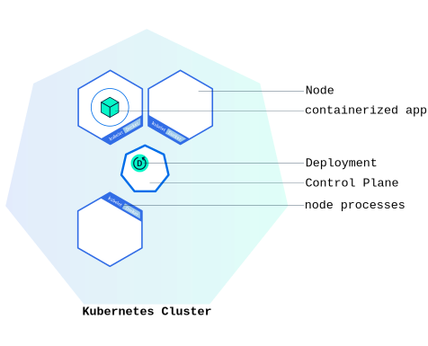

# kubectl을 사용해서 디플로이먼트 생성하기

## 1. 쿠버네티스 디플로이먼트

쿠버네티스 클러스터를 구동시키면 컨테이너화된 애플리케이션을 배포할 수 있다.
하지만 배포하기 이전에 쿠버네티스 디플로이먼트 설정을 만들어야 한다.

**디플로이먼트**: 쿠버네티스가 애플리케이션의 인스턴스를 어떻게 생성하고 업데이트해야 하는지를 지시한다.

    - 디플로이먼트가 만들어지면 k8s 컨트롤 플레인이 디플로이먼트에 포함된 애플리케이션 인스턴스가 클러스터의 개별 노드에 실행되도록 스케줄 함

    - 쿠버네티스 디플로이먼트 컨트롤러가 지속적으로 인스턴스를 모니터링

    - 인스턴스를 구동 중인 노드가 다운되거나 삭제되면, 디플로이먼트 컨트롤러가 인스턴스를 클러스터 내부의 다른 노드의 인스턴스로 교체 시킴
    이렇게 머신의 장애나 정비에 대응할 수 있는 자동 복구(self-healing) 매커니즘을 제공한다.

<p align="center">
    
</p>

```
일반적으로 인스턴스는 실행 중인 임의의 프로세스, 클래스의 현재 생성된 오브젝트를 의미한다. 컴퓨터 과학에서 인스턴스란 해당 클래스의 구조로 컴퓨터
저장공간에서 할당된 실체를 의미한다.

출처: 위키
```

## 2. Kubectl

Kubectl은 쿠버네티스 cli이다. 이것을 통해 디플로이먼트를 생성하고 관리할 수 있다.

    - 클러스터와 상호작용하기 위해 쿠버네티스 API를 사용한다.
    - 디플로이먼트를 생성할 때, 애플리케이션에 대한 컨테이너 이미지와 구동시키고자 하는 복제 수를 지정해야 한다.
    - 디플로이먼트를 업데이트해서 이런 정보를 나중에 변경할 수 있다.

k8s help

```sh
kubectl get nodes --help
```

view the nodes in the cluster:
k8s는 사용 가능한 노드 리소스를 기반으로 애플리케이션을 배포할 위치를 선택한다.

```sh
kubectl get nodes
```

create deployment

```sh
kubectl create deployment <deployment-name> --image=<app-image-location>

kubectl create deployment kubernetes-bootcamp --image=gcr.io/google-samples/kubernetes-bootcamp:v1
```

위 명령어를 작성하면 생기는 일

    - 1. 애플리케이션 인스턴스가 실행될 수 있는 적절한 노드를 찾는다.
    - 2. 노드에서 실행되도록 애플리케이션을 스케줄한다.
    - 3. 필요할 때 새로운 노드에 인스턴스를 다시 스케줄하기 위해 클러스터를 설정한다.

list deployments

```sh
kubectl get deployments
```

k8s 내부에서 실행되는 파드는 격리된 프라이빗 네트워크에서 실행된다.
기본적으로 동일한 k8s 클러스터 내의 다른 파드 및 서비스에서는 볼 수 있지만
해당 네트워크 외부에서는 볼 수 없다. kubectl을 사용할 때 API 엔드포인트를 통해 상호 작용하여 애플리케이션과 통신한다.

kubectl 명령은 클러스터 전체의 프라이빗 네트워크로 통신을 전달할 프록시를 생성할 수 있다. 프록시를 사용하면 이러한 터미널에서 API에 직접 액세스할 수 있다.

프록시는 ctrl + c를 통해 종료할 수 있고, 실행중에는 아무것도 출력되지 않는다.

proxy:

```sh
kubectl proxy
```

module2 endpoint test:

```sh
curl http://localhost:8001/version
```

**API 서버**는 파드 이름을 기반으로 프록시를 통해 액세스할 수 있는 각 파드에 대한 엔드포인트를 자동으로 생성한다.

store env POD_NAME:

```sh
export POD_NAME=$(kubectl get pods -o go-template --template '{{range .items}}{{.metadata.name}}{{"\n"}}{{end}}')
echo Name of the Pod: $POD_NAME
```

이렇게도 액세스 가능

```sh
curl http://localhost:8001/api/v1/namespaces/default/pods/$POD_NAME/
```
